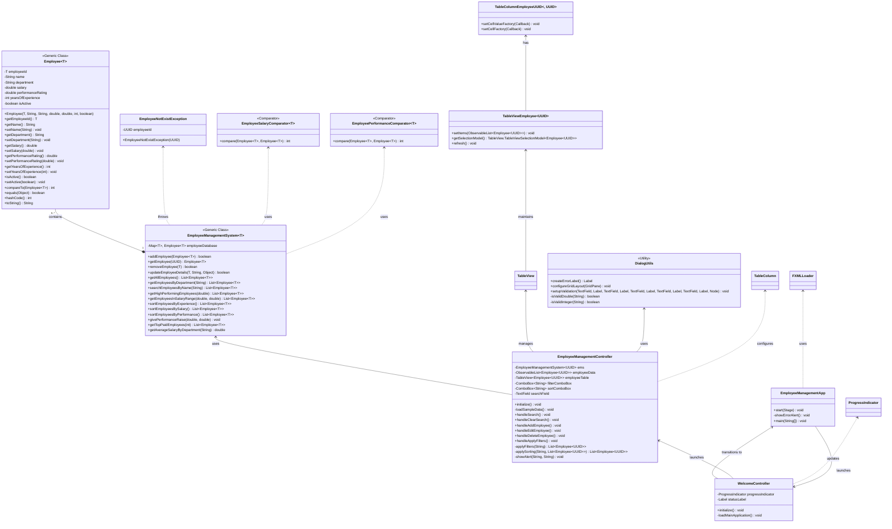

# 📊 Employee Management System  

A **JavaFX-based** application for managing employee records using **Java Collections, Generics, Streams, and Comparators**. Supports **CRUD operations, searching, filtering, and sorting** with a clean UI.  

---

## ✨ Features  

### **Core Functionality**  
✅ **Generic `Employee<T>` Class** – Type-safe employee records with unique IDs (UUID/Integer)  
✅ **CRUD Operations** – Add, remove, update, and retrieve employees via `HashMap<T, Employee<T>>`  
✅ **Search & Filtering** – Find employees by:  
   - Department  
   - Name (partial match)  
   - Performance rating (≥ threshold)  
   - Salary range  
✅ **Sorting** – Using `Comparable` (experience) & `Comparator` (salary, performance)  
✅ **Salary Analytics** – Raise calculations, top earners, department-wise averages  

### **Java Collections & Streams**  
📌 **HashMap** – Efficient employee storage & retrieval  
📌 **Stream API** – Filtering, sorting, and statistical operations  
📌 **Iterator** – Traversal for display/processing  

### **JavaFX UI**  
🖥️ **Interactive Dashboard** – View, add, and delete employees  
🔍 **Search & Sort** – Real-time filtering with dropdowns  
📋 **Formatted Reports** – Clean tabular display  

---

## 🧑‍💻 **Employee Class Structure**  
```java
public class Employee<T> implements Comparable<Employee<T>> {
    private T employeeId;          // UUID or Integer
    private String name;
    private String department;
    private double salary;
    private double performanceRating;  // 0-5 scale
    private int yearsOfExperience;
    private boolean isActive;
    
    // Constructor, Getters/Setters
    @Override 
    public int compareTo(Employee<T> other) { /* Sort by experience */ }
}
```

## 🛠️ Technical Implementation (Mermaid Diagram)



### **3. JavaFX UI Preview**  
  
*(To be replaced with actual screenshot post-implementation)*  

---

## 🚀 **Getting Started**  

### **Prerequisites**  
- Java JDK 17+  
- JavaFX SDK  
- Maven  

### **Installation**  
```bash
git clone git@github.com:thenoblet/ems.git
cd ems
mvn clean install
```

### **Run the Application**  
```bash
mvn javafx:run
```

---

## 📌 **Lab Objectives Achieved**  
✔ **Collections Framework** – `HashMap`, `List`, `Iterator`  
✔ **Generics** – Type-safe `Employee<T>` class  
✔ **Stream API** – Filtering (`filter`, `sorted`), analytics (`average`, `max`)  
✔ **Comparable/Comparator** – Custom sorting (experience, salary, performance)  
✔ **JavaFX UI** – Interactive CRUD operations  

---

## 📜 **License**  
MIT  

---

### **Suggested Improvements**  
1. Add **export to CSV/JSON** functionality.  
2. Implement **user authentication** (admin/employee roles).  
3. Enhance UI with **charts** for salary/performance analytics.  
